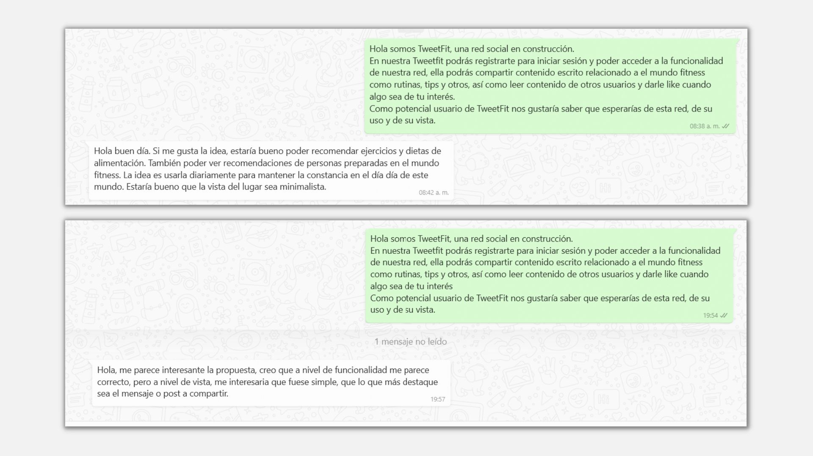

# TweetFit

 Red social para compartir consejos, rutinas, logros y motivación 
 relacionados con el mundo del fitness de manera concisa y rápida.

## Descripción del producto

TweetFit le da la bienvenida al usuario en la vista home, que le 
permite decidir si desea iniciar sesión con correo electrónico y 
contraseña o con Google, si el usuario no está registrado, tiene 
la opcion disponible para dirigirse a la página de registro. 
- Iniciando sesión con correo electrónico y contraseña:
  En esta vista el usuario visualiza un input para ingresar su
  dirección de correo electrónico y otro para ingresar su contraseña,
  ambos deben estar almacenados en la base de datos de firebase, en
  caso contrario, la aplicación emitirá un mensaje indicando el
  error.
  Si el usuario ha olvidado su contraseña, tiene la opción de
  recuperarla con un botón, que lo llevará a una vista para que ingrese
  una dirección de correo electrónico válida, a la cual se le
  enviará un link para restablecer su contraseña. Si ingresa
  una dirección de correo electrónico que no ha sido verificada,
  se le mostrará un mensaje en la pantalla.
   Una vez ingresados los datos correctamente el usuario
  podrá acceder a la vista del feed.
- Iniciando sesión con Google:
  Al seleccionar el botón de Google se abrirá una ventana
  emergente que provee google para seleccionar la cuenta con
  la que desea ingresar. Una vez iniciada la sesión se redirigirá
  a la vista de feed.
- Registrandose:
  En esta vista el usuario debe ingresar su correo electrónico,
  nombre de usuario, contraseña y confirmación de contraseña.
  Los inputs de contraseña tienen la opcion para ocultarla o
  visualizarla. 

  Una vez que el usuario se ha logueado, pasa a la vista del feed, donde puede visualizar las publicaciones de todos los usuarios y una casilla para escribir una publicación propia. 
  
  En el header del feed hay un botón con su imagen avatar que al seleccionarlo dirige al perfil, vista donde el usuario visualiza únicamente sus propios posts. También en el header, hay un botón para cerrar sesión y botones disponibles de accesibilidad que aumentan y disminuyen el tamaño de las fuentes para las personas que tienen problemas de visibilidad. 

  Los usuarios pueden interactuar entre sí con el botón de Like, éste cambia de color al seleccionarlo y se muestra el conteo de likes a un lado del ícono.

  El usuario logueado adicionalmente tiene disponibles dos botones en sus propias publicaciones, uno para editarla y otro para borrarla. 

  La app fue construida como SPA y es responsive.

  
## Planificación:

Para organizar y estructurar el proyecto fue utilizada la herramienta Trello. Se establecieron objetivos y tareas para construir paso a paso el proyecto. 
 
  [✔️] Establecimos temática de la app. Ideamos el objetivo, nombre y logo de la app.

  [✔️] Escogimos paleta de colores. 

  

  [✔️] Llevamos a cabo investigación de usuarios, respondiendo las siguientes preguntas:

  

  [✔️]Elaboramos las siguientes historias de usuario: 

  .jpg)
  .jpg)
  .jpg)
  .jpg)
  .jpg)
  .jpg)
  .jpg)

  [✔️] Elaboramos prototipos de baja y alta fidelidad.

  
  

  [✔️] Aplicamos test de usabilidad a 5 usuarios.

  [Ver resultados](https://docs.google.com/document/d/1zi0zpeZEEKPD2lybzpOivme6ZKEFK3P1/edit?usp=drive_link&ouid=114967044527011804122&rtpof=true&sd=true)
  

## Cambios en el producto final:

  
